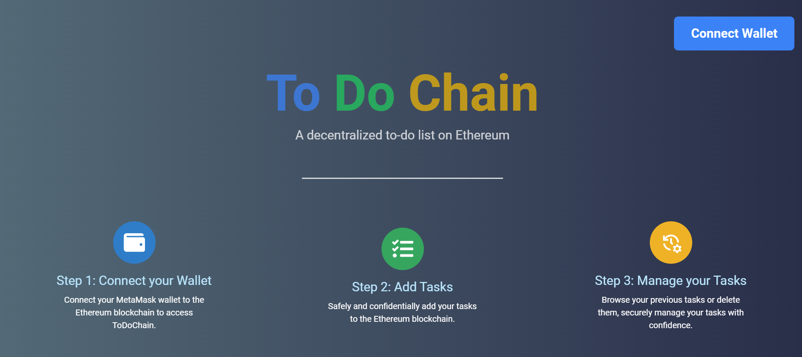

# ToDoChain⛓️

ToDoChain is a decentralized to-do list application built on Ethereum blockchain, empowering users to manage their tasks securely while leveraging the benefits of blockchain technology. With MetaMask integration, users can seamlessly interact with the Ethereum network, ensuring a smooth and secure task management experience. Here is the link of the web site :  <a href="https://todochain.alexandrebourdois.com/">https://todochain.alexandrebourdois.com</a>

	

## Features

- **Decentralized Task Management:** Utilize the power of blockchain to securely manage your tasks without relying on a centralized authority.
- **MetaMask Integration:** Seamlessly interact with Ethereum blockchain through MetaMask, ensuring secure transactions and data handling.
- **User-friendly Interface:** Intuitive and easy-to-use interface powered by React and Tailwind CSS, providing a smooth user experience.
- **Immutable Records:** Tasks are stored on the Ethereum blockchain using Solidity smart contracts, ensuring immutability and transparency.

## Technologies

### React

React is a JavaScript library for building user interfaces, known for its simplicity and scalability. ToDoChain utilizes React to create a dynamic and responsive interface, providing users with an intuitive task management experience.

### Next.js

Next.js is a React framework that enables server-side rendering and simplifies the creation of React applications. ToDoChain leverages Next.js to enhance performance and optimize SEO, ensuring a seamless user experience.

### Truffle

Truffle is a development environment, testing framework, and asset pipeline for Ethereum blockchain. ToDoChain utilizes Truffle to streamline the development process, manage smart contracts, and facilitate testing, ensuring robustness and reliability.

### Solidity

Solidity is a programming language used for writing smart contracts on Ethereum blockchain. ToDoChain leverages Solidity to implement smart contracts for task management, enabling secure and transparent interactions on the Ethereum network.

## Contribution

We welcome contributions from the community to enhance ToDoChain. Feel free to submit bug reports, feature requests, or pull requests via GitHub.

## Credits

- [**Alexandre BOURDOIS**](https://github.com/alexandre-bourdois) : Creator of the project.

## License

ToDoChain is licensed under the MIT License
